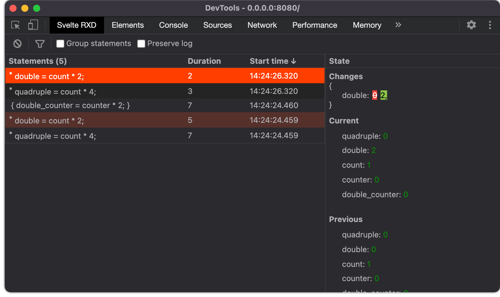
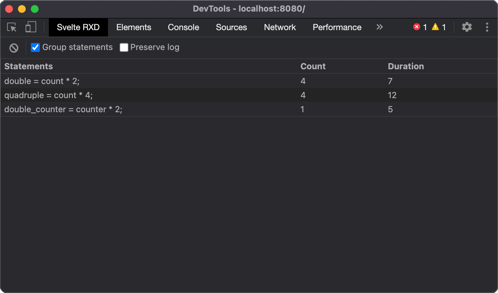

# Svelte Reactive Debugger
Easily monitor svelte reactive statements

This extension needs this custom preprocessor to work
https://github.com/unlocomqx/svelte-reactive-preprocessor

## Install (Chrome/Firefox)
[](https://chrome.google.com/webstore/detail/svelte-reactive-debugger/mieppkcamgfhpjedhnfdlbndijhohmjf)
[](https://addons.mozilla.org/en-US/firefox/addon/svelte-reactive-debugger/)

## List
The extension displays the statements as they are executed



## Summary
The statements are grouped to show the total count and duration of each statement



# How to build
```shell
npm i && npm i --prefix app
npm run build
```
_Built using node 15.4.0 and npm 7.0.15_

# How to test (requires Firefox)
```shell
npm run start
```
